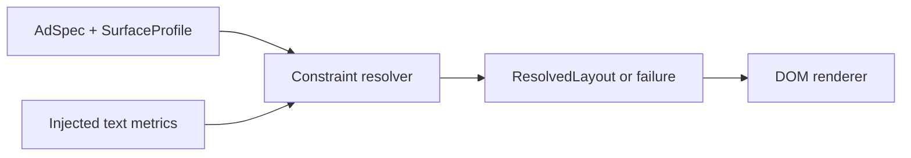

# Architecture

The engine is a bounded feasibility search with ordered degradation. It owns placement logic; React is the demo/rendering layer.



## Domain objects

`AdSpec` contains ordered elements, colors, and font family. `AdElement` is a union of text/image/button definitions with constrained roles, priority, optionality, and size constraints. Declaration order supplies reading order and the priority tie-break.

`SurfaceProfile` supplies dimensions, four safe insets, padding/gap, text/tap minima, viewing distance, and touch behavior. Identity is presentation metadata only.

`ResolvedLayout` distinguishes success, invalid input, and unsatisfiable constraints. Each element has a rectangle, visibility, variant, font/line height, explicit lines, and content padding. Diagnostics record reasons. Hidden elements retain IDs with zero geometry; failure results contain no renderable elements.

## Resolver stages

1. `validation.ts` checks numbers, content, IDs, roles, typography, colors, and permitted URL forms. Primary, hero, and action must each have a non-optional element.
2. `resolver.ts` derives usable bounds, hard floors, candidate preference, and stable degradation order.
3. `placement.ts` creates candidate rectangles; `text.ts` measures wrapping/truncation through the injected width function.
4. Return a successful candidate. If all three fail, advance exactly one eligible element and retry every candidate.
5. Exhausted variants return `unsatisfiable`. Invalid or throwing measurement adapters return `invalid` with a reason.

## Hard and soft constraints

```text
x = safeArea.left + padding
y = safeArea.top + padding
width  = surface.width  - safeArea.left - safeArea.right  - 2 * padding
height = surface.height - safeArea.top  - safeArea.bottom - 2 * padding
```

| Hard                                                  | Soft                                  |
| ----------------------------------------------------- | ------------------------------------- |
| Positive finite geometry inside usable bounds         | Preferred composition                 |
| Element width and image-height minima                 | Preferred dimensions/fonts            |
| Text floor and element font minima                    | Optional visibility                   |
| Both touch CTA dimensions at least minTapTarget       | Complete copy at compact text variant |
| Padding/gap, allowed line counts, complete CTA labels | Spare-width distribution              |
| Required visibility                                   |                                       |

Text floor is `max(minTextSize, ceil(10 × viewingDistance))`. Distance is in metres; this is a surface-pixel policy, not physical calibration. Element font minima can raise it further. Preferred text width grows when the surface raises typography, but measured lines still have to fit.

## Composition reasoning

Usable aspect ratio orders candidates: below `0.8` prefers stack, above `2.6` prefers inline, otherwise split. Try that preference, then the remaining operators in stack/split/inline order. Orientation preference never bypasses feasibility checks.

- **Stack:** declaration-order vertical placement. Text uses available width; images/buttons keep their current preferred width bounded by the column and checked against minima. Center images horizontally and the group vertically.
- **Split:** reserve left for the first hero and right for remaining elements. Current preferred column widths plus gap must fit. Divide extra width evenly, center both groups vertically, and use stack for the content column.
- **Inline:** declaration-order horizontal placement. Allocate extra width with weight 2 for primary content, 1 for heroes, 0 for others. Center each element vertically.

Engine code uses no target-specific dimensions and reads no surface ID/name. Role-specific hero treatment is shared by all surfaces. Adding a fifth surface adds numeric input only.

## Priority and degradation

Sort by descending numeric priority, then descending declaration index. Larger numbers degrade first; ties sacrifice later declarations first. Optionality independently permits hiding.

Variants are full → reduced → compact → hidden. Reduced sizes move halfway to minima. Reduced image height also caps to usable height, but only after that image becomes eligible for degradation. Compact uses valid minima and at most two text lines with a measured ellipsis. Buttons never truncate. Required elements stop at compact; optional elements can be hidden.

Each failed state tests all three operators. For `n` elements, there are at most `3n` transitions and `3(1 + 3n)` candidate attempts. Placement has small linear scans, while text cost depends on copy length; no strict linear-runtime claim is made. A per-resolution cache avoids repeating width measurements. React memoization avoids resolving again for bounds toggles and preview zoom.

## Collision and bounds guarantee

Stack advances a vertical cursor by height plus gap. Inline advances a horizontal cursor by width plus gap. Split reserves disjoint columns and stacks within one. Operators reject candidates whose required widths or measured heights exceed their reserved region.

Font size, line boxes, and content padding are part of fitting. Padding is carried in the result and applied by the renderer, eliminating independent CSS padding that could invalidate measurement. Unit tests independently calculate expected usable bounds and check rectangles, every pairwise intersection, text lines, and minima. Browser tests inspect actual DOM boxes and text ranges. Diagnostic/focus outlines are overlays, not content rectangles.

## Renderer boundary

`TextMeasurer(text, size, weight, family)` keeps the core DOM-independent. Node uses estimates; `rendering/measureText.ts` injects canvas widths. The ad shares Arial between measurement and DOM, independently of workbench fonts. Downloaded ad fonts would require awaiting font load and resolving with matching metrics.

`DomRenderer.tsx` draws absolute rectangles, explicit lines, contained images, and CTA anchors. It does not branch on composition or independently reflow text. Truncated visual copy exposes its full text to assistive technology.

`SurfacePreview.tsx` uses ResizeObserver only for display scaling. Native-size inspection scrolls locally. Media queries rearrange workbench columns, never the ad. Canvas rendering could consume the same output but is not implemented.

## Tradeoffs and generalization

The search is explainable but incomplete. Greedy degradation never restores optional content or minimizes a global visual-loss score. Other arrangements or backtracking could retain more content. `unsatisfiable` is therefore scoped to supported operators/variants.

Tests rename surface/element IDs, make identity getters throw, add elements, exercise the exact interview profile, and generate unseen surfaces. No new profile needs engine changes. New content roles, arbitrary multi-hero mosaics, complex-script shaping, print bleed, or physical calibration require explicit domain or policy extensions.
